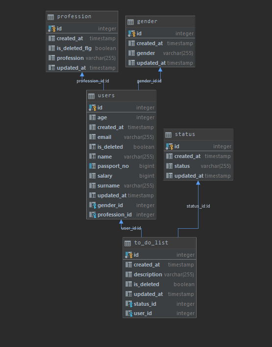
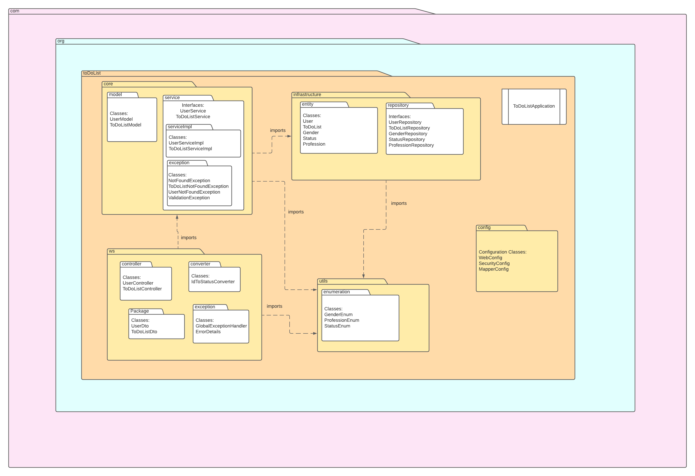

# todolist_final
## toDoList Application 

This project is a Spring Boot 
that is used to add/update/get/delete 
users and their todo lists.
Each person has his/her todo list. 
Each todo list has a status.

## Data

## Package structure

